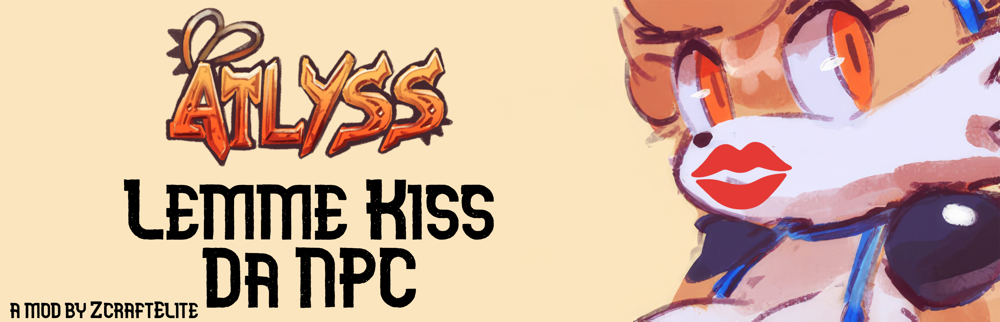

# Lemme Kiss Da NPC

## A Mod for ATLYSS

 

   

### What is this beautiful batch of code?
LemmeKissDaNPC is a mod designed for the ATLYSS game. This mod removes the hitbox from all NPCs (when possible) to allow you to get as close as possible to your favorite ATLYSS NPCs—because who wouldn’t want to share a sweet, hot, and sexy moment with your favorite NPC~

All jokes aside, this mod removes the magical forcefields (hitboxes) around NPCs. So if you have ever been annoyed from running into NPCs constantly while dashing, wanted to take some cute screenshots with your favorite NPCs, or wanting to do... whatever ya'll gooners wanna do, then this is the mod for you!

Credit for the original idea is Kief (xxkiefxx on Discord) who was semi-ranting to me over the fact he wanted to be closer to Skrit. As well as that, he was frustrated with dashing and then getting stopped by running into npcs (like many members of the ATLYSS community). So I made this beautiful mod for him and the community to ~~kiss their favorite NPCs~~ get rid of the terrible, horrible NPC forcefields.

### Prequisites

#### 1. EasySettings
In order to use this mod, you will have to put the EasySettings.dll from [here](https://thunderstore.io/c/atlyss/p/Nessie/EasySettings/)
 in your plugins folder. This allows me to introduce compatibility with the settings menu and is used to manage the new easter egg feature at the moment, more uses for it will come later :3

### Installation Instructions

#### 1. Install BepInEx / Melon Loader (COMING SOON)
To use this mod, you'll first need to install **BepInEx**, a popular modding framework for Unity games. 

**IMPORTANT NOTE**: Support for **Melon Loader** is coming soon!!! This will ensure support with other mods, like the ones from [Lilly](https://github.com/Buttered-Lilly), and other popular mods.

- **Step 1**: Download the BepInExPack for your platform from [Thunderstore](https://thunderstore.io/).
  - Go to the [BepInExPack page](https://thunderstore.io/c/atlyss/p/BepInEx/BepInExPack/).
  - Download the latest version of the BepInExPack.
  
- **Step 2**: Extract the downloaded files and place the contents from **inside of the `BepInExPack` folder** in your ATLYSS game folder. This is usually the folder where `ATLYSS.exe` is located.

#### 2. Download and Install the LemmeKissDaNPC Mod
- **Step 1**: Download the latest `.DLL` release for LemmeKissDaNPC from the [GitHub Releases page](https://github.com/zcraftelite9495/lemmekissdanpc/releases).
  
- **Step 2**: After downloading the `.DLL` file, navigate to the `BepInEx` folder within your game directory.
  - Inside the `BepInEx` folder, find the `plugins` directory (if it doesn't exist, you can create it).
  - Place the `.DLL` file inside the `plugins` folder.

- **Step 3**: Launch the game! The mod should now be active and remove NPC hitboxes as you approach them.

#### 3. Building the Project from Source

If you'd like to build the mod from source, here’s how:

- **Step 1**: Clone this repository to your local machine using Git:
  ```bash
  git clone https://github.com/zcraftelite9495/lemmekissdanpc.git
  ```

- **Step 2**: Open the project in **Visual Studio** or any C# compatible IDE.

- **Step 3**: Make sure you have the **BepInEx** & **C-Sharp Assemblies** reference set up in your project:
  - Download the latest BepInEx assemblies and reference them in your project.
  - You can find BepInEx assemblies in the `BepInEx` folder inside your game directory.

- **Step 4**: Build the project.
  - In Visual Studio, simply press `Ctrl+Shift+B` to build the solution.

- **Step 5**: After building, you will find the `.DLL` file somewhere in the `bin` folder.
  - Follow the same installation instructions above to place the `.DLL` file in the `plugins` folder of your ATLYSS game directory.

### Troubleshooting
- **The mod isn’t working**: Ensure that the BepInExPack is properly installed, and the `.DLL` file is placed in the `BepInEx/plugins/LemmeKissDaNPC` folder. Double-check the game directory structure.
- **Warnings or errors in the log**: Check the `BepInEx/LogOutput.log` file for any error messages that might point to missing references or other issues.